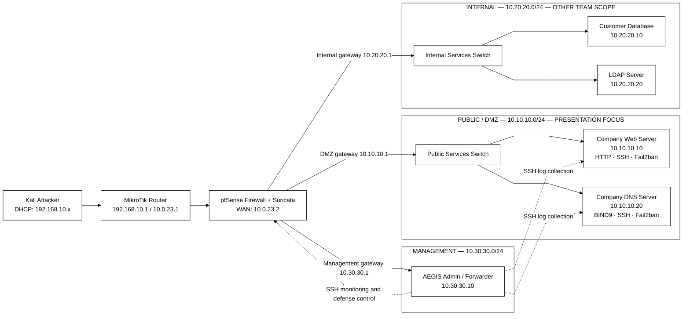
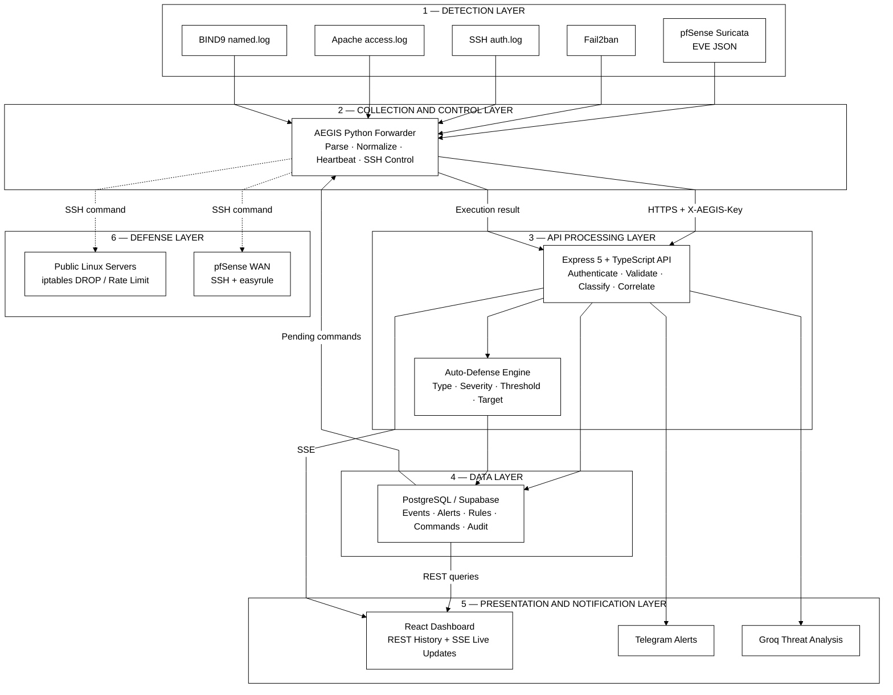
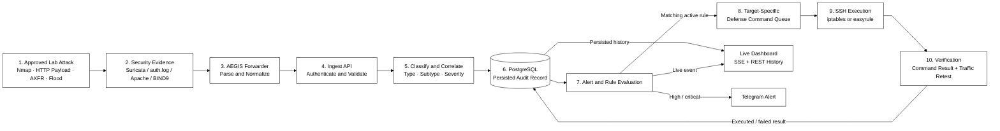
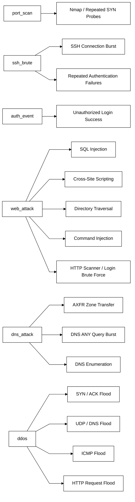
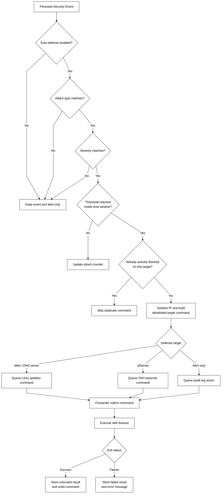

# AEGIS Public-Segment Presentation Diagrams

These diagrams use monochrome Mermaid markup so they can be pasted directly
into diagrams.net (draw.io) without exposing credentials or deployment URLs.

## Import into draw.io

1. Open <https://app.diagrams.net/> and create a blank diagram.
2. Select **Arrange → Insert → Advanced → Mermaid**.
3. Paste one complete Mermaid block from this document.
4. Select **Diagram**, click **Insert**, and use **File → Export as** to export
   SVG or PNG for PowerPoint.
5. Keep the aspect ratio locked when resizing the exported image.

The diagrams deliberately use only white fills, black text, black borders, and
dashed black monitoring/control links. Do not place secrets, database URLs,
API keys, tokens, or SSH private-key contents in a presentation diagram.

## 1. Public network architecture

Use this on the **Public Network Architecture** slide. The detailed focus is
the DMZ Web and DNS servers; the internal segment is included only to explain
segmentation and scope boundaries.

## 2. Layered system architecture

Use this on the **System Architecture Design** slide. It explains which
component detects, collects, processes, stores, displays, and responds.

## 3. End-to-end security data flow

Use this on the **System Flow and Data Flow** slide. It shows the authoritative
order: persist the event before broadcasting it, then evaluate and execute any
matching defense rule.

## 4. Public attack classification

Use this on the **Public Attack Categories** slide. The left column contains
the dashboard/defense top-level types; the right-side nodes contain the public
attack signatures or subtypes grouped under each type.

## 5. Auto-defense decision and execution flow

Use this on the **Automated Defense Pipeline** slide. The decision diamonds
make it clear that detection does not automatically mean an unrestricted shell
command will run.

## Export recommendations

- Export as **SVG** for the clearest PowerPoint text and lines.
- Use a white page/background and black text at presentation time.
- Use 16:9 landscape pages for diagrams 1–3 and 5.
- Diagram 4 can use landscape or a two-column portrait layout.
- Do not shrink a diagram until labels are smaller than the PowerPoint body
  text. Split a dense diagram across two slides instead.
- Add a short caption below each image, for example:
  `Figure 9.1 — AEGIS Layered System Architecture`.
